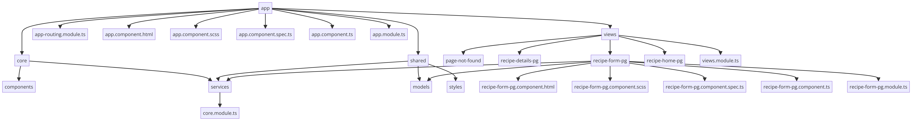

# NgSweeftRecipeSharingProject

This project was generated with [Angular CLI](https://github.com/angular/angular-cli) version 17.0.5.

## Getting Started

These instructions will get you a copy of the project up and running on your local machine for development and testing purposes.

### Prerequisites

What things you need to install the software and how to install them:

```bash
node -v // Check if Node.js is installed
npm -v // Check if npm is installed
```

## Installation

A step-by-step series of examples that tell you how to get a development environment running:

1. **Clone the repository**

   ```bash
   git clone https://github.com/yourusername/yourprojectname.git

   ```

2. **Navigate to the project directory**

`cd yourprojectname`

3. **Install dependencies**

`npm install` 4. **Run npx json-server --watch db.json to start json-server**

`npx json-server --watch db.json`

## Application Structure



## libraries

*sweetAlerts
*angular material

#Author

- Giorgi Bidzishvili
